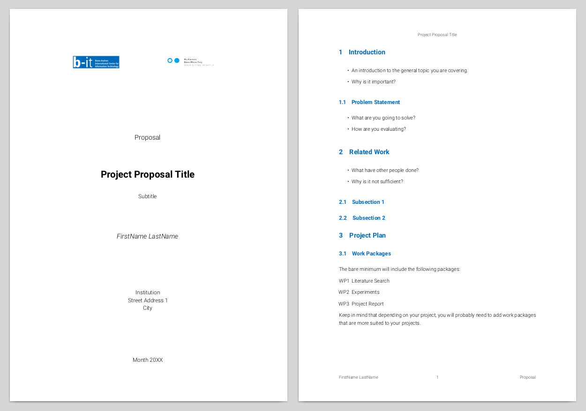

# Latex template for project proposal 

----------

### Description

This repository contains a style file, `proposal_style_template.cls`, providing the definitions for a new Latex class of the same name (`proposal_style_template`). It also provides a template `.tex` file that can be populated with content. The template showcases examples for all important elements of a proposal, such as nicely formatted title page, figures, lists, and so on. This template is originally developed under the name of `mas_proposal.cls` by the [MAS group of the Univeristy Bonn-Rhen-Sieg, Germany](https://mas-group.inf.h-brs.de/).

### Installation

- Requires a Latex installation, such as `texlive` for Ubuntu linux, or `Miktex` for Windows
- Has a number of dependencies that need to be installed, such as:
  - `texlive-base`
  - `texlive-binaires`
  - `texlive-latex-base`
  - `texlive-latex-extra`
  - `texlive-latex-recommended`
  - `texlive-pictures`
  - `texlive-fonts-extra`

### Rendering

The most simple option is to use a free tool like [Texmaker](http://www.xm1math.net/texmaker/) that will help you rendering to PDF with one click. The result will look like this:

